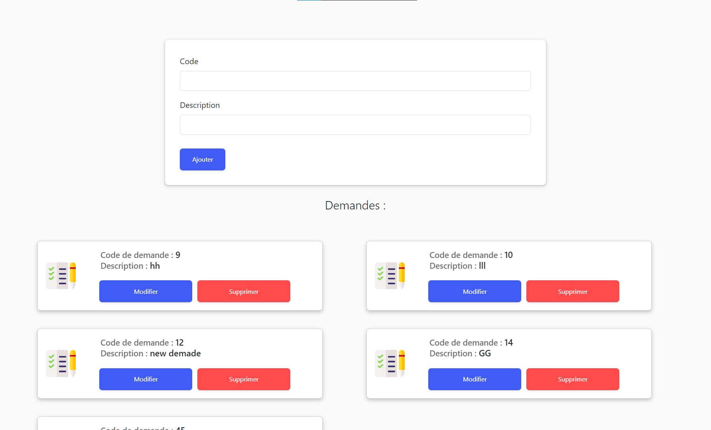
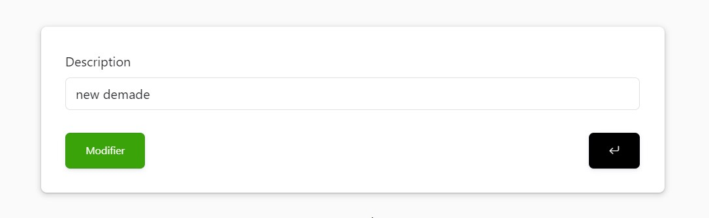
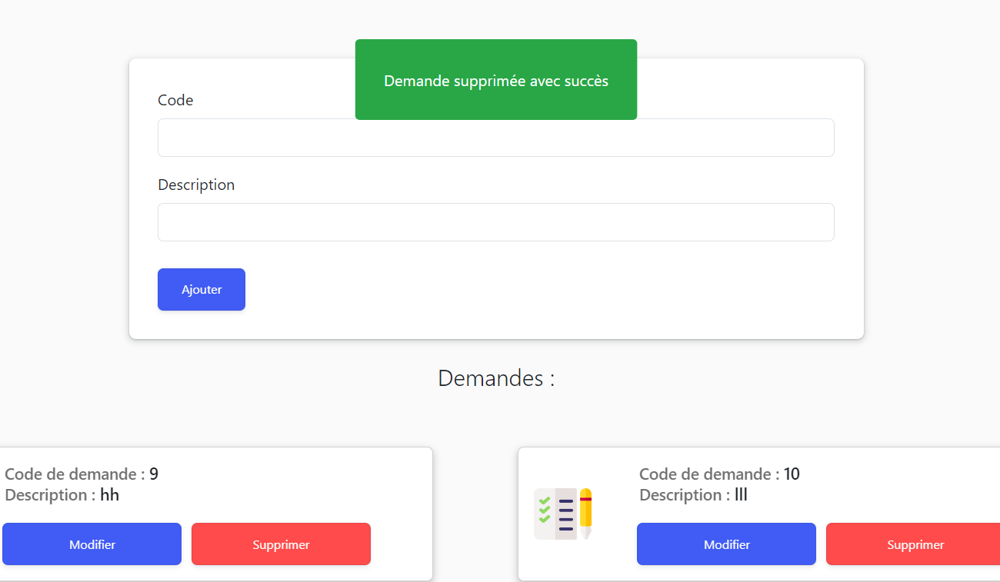

# Demande Management Project

This repository contains the project for demande management. It includes features such as adding, updating, and deleting demands.

## Screenshots

### Add Demande Form with List of Demands

This screenshot shows the add demande form along with the list of demands retrieved and displayed from the database.

### Update Demande Form

This screenshot displays the update form for the demande, where users can modify existing demands.

### Success Message for Deleted Demande

This screenshot demonstrates a success message indicating that a demande has been deleted successfully.

## How to Use

To use this project, follow these steps:

1. Clone the repository to your local machine.
2. Install any necessary dependencies.
3. Run the application.

## Features

- Add new demands to the system.
- Update existing demands.
- Delete demands from the system.
- View a list of demands.
- Display success messages for various actions.

## Technologies Used

- Java
- Spring Boot
- Thymeleaf
- HTML
- CSS
- JavaScript
- Bootstrap

## Contributing

If you'd like to contribute to this project, feel free to fork the repository and submit a pull request.

## License

This project is licensed under the MIT License - see the [LICENSE](LICENSE) file for details.
